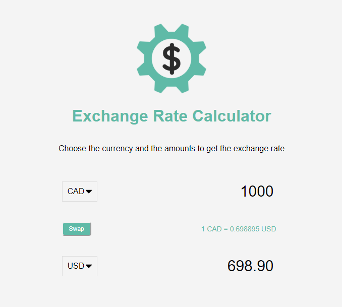

## Exchange Rate Calculator

Created with HTML, CSS, and vanilla JavaScript (no frameworks or libraries). Utilizes the Fetch API and working with JSON data. This is part of Brad Traversy's '20 Vanilla Projects' series.

